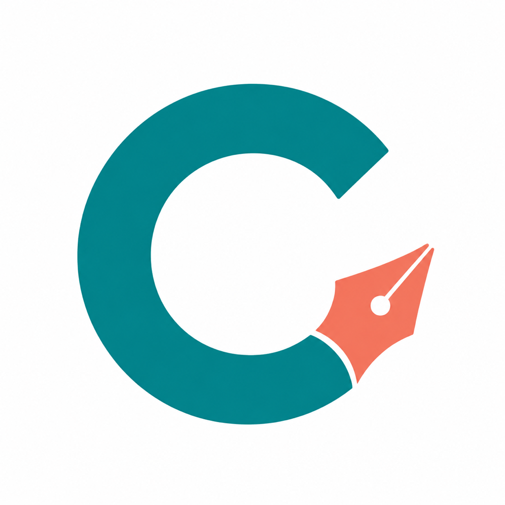
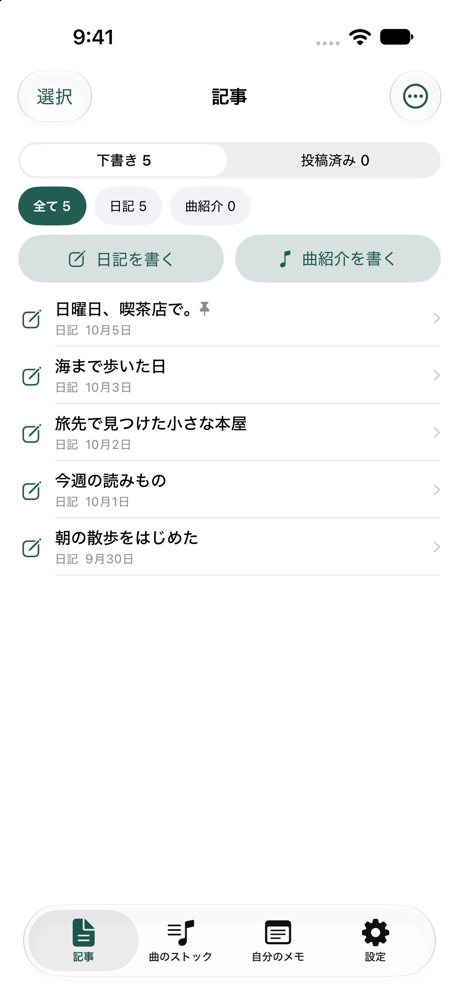
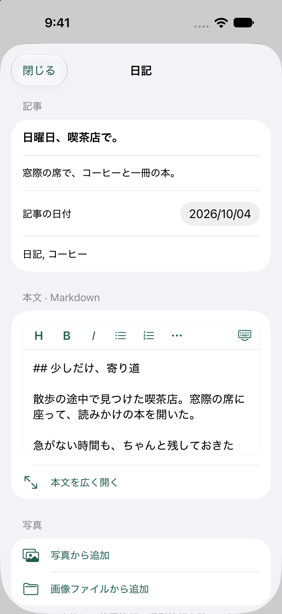
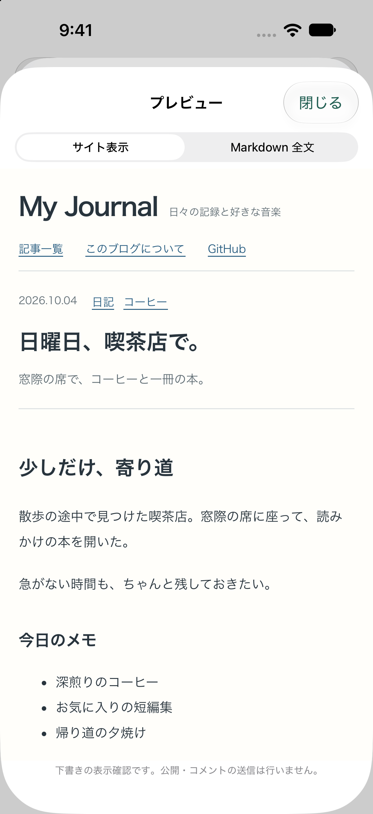

  

<h1 align="center">cocoWriter</h1>

<strong>Your words, your own GitHub Pages.</strong> A native iPhone Markdown writer for your personal blog.

<a href="../README.md">日本語</a> · <a href="content-format.md">Configuration guide</a>

cocoWriter is a native iPhone app for writing Markdown articles, adding photos, collecting music links, and publishing to your own GitHub Pages blog. It is an independent version of CocoG Writer. It uses a separate bundle identifier and local storage, and shares the original CocoG Writer icon.

## Write, preview, publish

| Keep your drafts together | Write in Markdown | Preview your blog |
| :---: | :---: | :---: |
|  |  |  |

iPhone Simulator screenshots with sample content. The articles have not been published.

## Get started

You can also [generate a configured Xcode project](app-variants.md) with your own display name, app and extension identifiers, App Group, storage directory, Keychain service, and initial publishing destination. Generated projects reference the shared source files. To upgrade an existing installation, preserve its identity and storage configuration.

Clone `https://github.com/cocoG3k/cocoWriter.git` and open a terminal in the `cocoWriter` directory. The app is distributed as source and requires a Mac to build; it is not available on the App Store.

1. Run `python3 tools/create-blog.py ../my-journal`. Put the generated folder's contents at the root of a new GitHub repository, including `.github/`.
2. Change the blog name in `site.config.json`, edit or remove the sample article, and set Settings → Pages → Source to **GitHub Actions**. Run the Pages workflow.
3. Run `python3 tools/configure-signing.py --bundle-id com.yourname.cocoWriter`, then open `ios/cocoWriter.xcodeproj`. Select your signing team for both app and share extension, and configure their matching App Group. Build the `cocoWriter` scheme for your iPhone.
4. In the app's settings, save your GitHub owner, repository, publishing branch, full HTTPS website URL, and preview title. For a project site, include the repository prefix: `https://username.github.io/my-journal/`.
5. Save a fine-grained personal access token with **Contents: Read and write** for that repository in the app's Keychain field. Review an article and publish it. Check both the commit and the Pages deployment.

Requires Xcode with Swift 6.2 or newer, iOS 17 or newer, and Node.js 22 or newer for the blog. The project ships with no signing team, token, personal content, or fixed publishing destination. App signing and physical-device installation require your own setup.

The default profile writes Markdown under `src/content/diary/` and photos under `public/images/diary/`. Before building, use `python3 tools/configure-blog.py config/jekyll.json` or a Hugo profile to select different paths, filename patterns, field names, YAML/TOML/JSON headers, dates, fixed metadata and image references. Validate your configuration with `--check`. Apply the same profile to the included blog using `--blog ../my-journal`. Existing Jekyll/Hugo profiles use absolute image URLs including the project Pages prefix. A build profile can also select an HTML/CSS preview shell through `preview.templateFile`; examples for sfuji.org are included. The selection tool bundles the content profile and preview template separately. See the [configuration guide](content-format.md) for supported syntax and limits. The included template supports user Pages, project Pages and configured custom domains. Other generators need a compatible content pipeline; this is not a universal client for every GitHub Pages repository.

Articles, personal notes and the music library stay on the device. Personal notes have no publishing action. Keep exports of important articles. The original app's data and tokens are not migrated automatically.

Changing the publishing destination clears its token and is blocked while connected articles or operations exist. Export articles, resolve pending operations, and remove connected articles from the device's trash before switching. Renaming the site or changing its website URL is supported without switching repositories.

For development, run `python3 tools/check-project.py`, `python3 tools/test-ios.py`, and `npm ci && npm test && npm run build` in `site-template/`. See [validation](VALIDATION.md), [content format](content-format.md), [contributing](../CONTRIBUTING.md), and [third-party notices](../THIRD_PARTY_NOTICES.md).

The project's own code and assets are MIT licensed. Dependencies retain their upstream licenses. Authors retain the rights to their own blog articles and photos.
